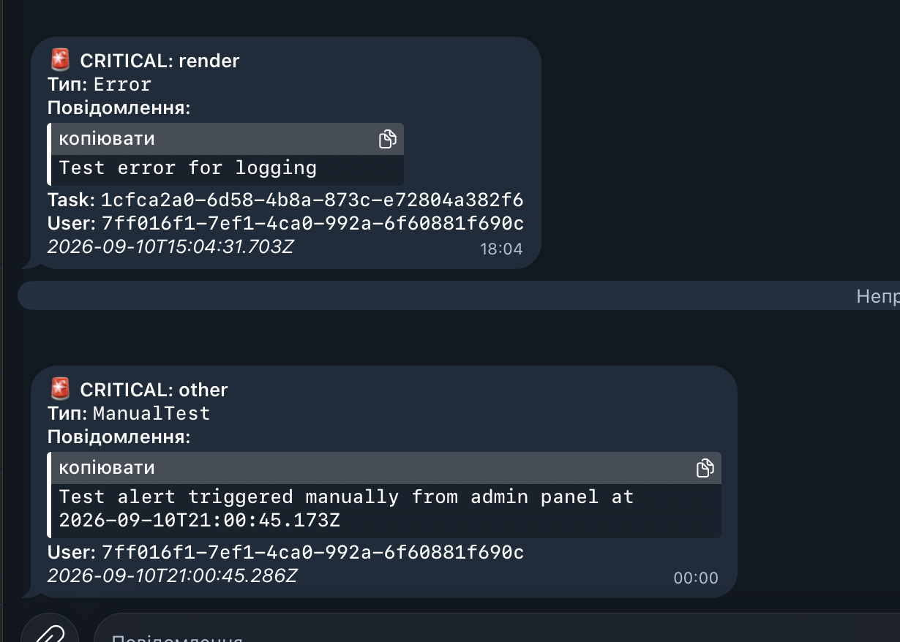
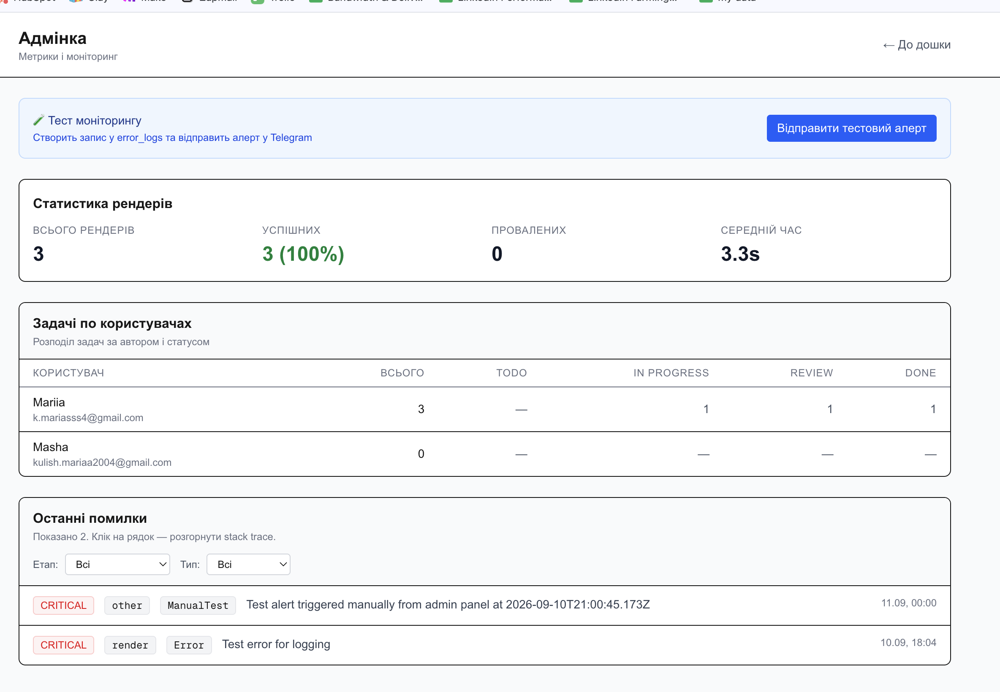

# Video Tasks

Мінітул для роботи над відео-задачами: Kanban-дошка з відео-пайплайном на основі FFmpeg (scene detection + рендер), система версій монтажу, review-flow і моніторинг.

**Live demo:** video-tasks-production.up.railway.app

**Тестовий акаунт (адмін):**
- Email: kulish.mariaa2004@gmail.com
- Password: mashamasha

Після логіну під цим акаунтом у header з'явиться посилання **«Адмінка»** — там доступна кнопка тестового Telegram-алерту.

---

## Стек

- **Next.js 16** (App Router, Server Components + Server Actions, TypeScript)
- **Supabase** — Auth, PostgreSQL, Storage (два bucket'и: `source-videos`, `rendered-videos`)
- **FFmpeg** — scene detection (фільтр `select` з порогом 0.1) і рендер (`filter_complex` з `trim` + `concat`)
- **dnd-kit** — drag&drop для Kanban і таймлайн-редактора
- **Tailwind CSS** — стилі
- **Telegram Bot API** — критичні алерти
- **Docker + Railway** — деплой з кастомним Dockerfile (FFmpeg на Alpine)

---

## Ключові технічні рішення

### Чому Next.js App Router (а не окремий фронт + бек)

Один застосунок замість двох сервісів — простіший деплой на Railway, менше конфігу. Server Components дають нативний доступ до БД без бойлерплейту API-роутів, Server Actions замінюють CRUD-endpoints для форм. API routes використовуються тільки де вони справді потрібні: upload processing, render, download proxy.

### Чому синхронна обробка (а не черга задач)

Планувала pg-boss або BullMQ, але для відео до 30 секунд обробка займає 2–15 секунд. Черга додала б інфраструктурну складність (окремий worker-процес на Railway = подвійна ціна) без реальної вигоди. Прогрес-індикатори на клієнті вирішують UX-проблему очікування. **Для production з довшими відео — обов'язковий перехід на черги.**

### Чому кастомний Dockerfile (а не Nixpacks)

Nixpacks (дефолт Railway) не встановлює FFmpeg, а він критично потрібен. Кастомний Dockerfile на Alpine Linux дає повний контроль + multi-stage build робить фінальний образ ~200MB (замість ~1.5GB).

### Чому dnd-kit (а не react-beautiful-dnd)

react-beautiful-dnd архівовано і не підтримується. dnd-kit сучасний, працює з touch і клавіатурою (accessibility), має менший бандл. Для Kanban використана стандартна стратегія, для таймлайну — горизонтальний sortable.

### Чому scene detection threshold = 0.1

Стандарт з документації FFmpeg — 0.4, але на реальних тестових відео (TikTok-стилістика зі швидкими cut'ами) він пропускав багато склейок. 0.1 знайшов усе, але з очікуваними false positives на різких змінах освітлення. Підбирався експериментально на 5+ різних відео.

### Чому copy-on-write для версій монтажу

Версії створюються копіюванням сегментів з попередньої версії (або базових сцен для v1). Це дозволяє юзеру безпечно експериментувати з v2, не втрачаючи роботу над v1. Стандартний паттерн з Google Docs / Notion.

---

## Схема бази даних

```
auth.users (Supabase Auth)
    │
    └──1:1── profiles (id, email, full_name, is_admin)
              │
              └──1:N── tasks (title, description, status, source_video_path, duration)
                        │
                        ├──1:N── scenes (scene_index, start_sec, end_sec)
                        │        [іммутабельний результат FFmpeg]
                        │
                        ├──1:N── versions (version_number, name, render_status, rendered_video_path)
                        │        │
                        │        └──1:N── version_segments (position, start_sec, end_sec, source_scene_id)
                        │                 [мутабельний таймлайн — окремий для кожної версії]
                        │
                        └──1:N── comments (body, user_id, created_at)

error_logs (stage, error_type, message, stack_trace, user_id?, task_id?, is_critical)
```

**Ключове рішення:** `scenes` і `version_segments` — це різні сутності. Сцени — це "правда з FFmpeg", змінюваний список — це "мій монтаж". Одна задача може мати кілька версій, у кожної свій набір сегментів.

Всі таблиці мають RLS-політики. Записи в `scenes`, `versions`, `error_logs` робляться тільки через service_role (обходить RLS), читання — авторизовані користувачі.

---

## Архітектура відео-пайплайну

```
1. Upload
   Browser → Supabase Storage (source-videos)
   ↓
2. Save path
   Browser → Server Action → tasks.source_video_path

3. Probe duration
   Browser → POST /api/tasks/[id]/probe
   ↓ Server: download → ffprobe → parseFloat(duration)
   ↓ Update tasks.source_video_duration_sec

4. Scene detection
   Browser → POST /api/tasks/[id]/detect-scenes
   ↓ Server: download → ffmpeg -vf "select='gt(scene,0.1)',showinfo"
   ↓ Parse stderr → INSERT scenes
   ↓ Auto-create v1 with all scenes as segments

5. Edit timeline (drag/cut/delete/reset)
   Browser → Server Action → DELETE + INSERT version_segments
   ↓ Reset versions.render_status = 'pending'

6. Render
   Browser → POST /api/versions/[versionId]/render
   ↓ Server: download → ffmpeg -filter_complex "[0:v]trim=...,[0:a]atrim=...,concat=..."
   ↓ Upload rendered file → rendered-videos
   ↓ Update versions.rendered_video_path, tasks.status='review'

7. Download rendered
   Browser → GET /api/versions/[versionId]/download
   ↓ Server proxies file with Content-Disposition: attachment
```

Всі API-роути під `/api/tasks/*` і `/api/versions/*` вимагають авторизації. FFmpeg-операції загорнуті в try/catch з централізованим логуванням (див. нижче).

---

## Обробка помилок і моніторинг

Централізована функція `logError(stage, message, options)` (`lib/error-logger.ts`) робить дві речі:
1. Записує в таблицю `error_logs` з timestamp, stage, error_type, stack_trace, task_id, user_id
2. Якщо `critical: true` — паралельно шле алерт у Telegram через `sendTelegramAlert()`

**Критичні (йдуть у Telegram):** render errors, scene detection errors.
**Не критичні (тільки в БД):** probe помилки, транзієнтні мережеві помилки.

Дедуплікація Telegram-алертів: однакове повідомлення (за перші 50 символів + stage + error_type) не шлеться повторно протягом 5 хвилин, щоб уникнути флуду при системному збої.

В адмінці є кнопка **«Тест моніторингу»** — тригерить штучний критичний алерт для перевірки що ланцюжок працює.

[СКРІН:     — приклад алерту в Telegram]

[СКРІН:  — адмінка з error_logs, метриками і тестовою кнопкою]

---

## Edge cases (протестовано вручну)

| Сценарій | Очікування | Результат |
|---|---|---|
| Відео 2–3 сек | 1 сцена або кілька коротких | ✓ 1 сцена, render працює |
| Відео без склейок (статичне) | 1 сцена на всю тривалість | ✓ Правильно |
| Порожній таймлайн (усі сегменти видалено) | Помилка при рендері | ✓ Кнопка "Зрендерити" стає неактивною |
| Дуже короткий сегмент (0.2s після розрізу) | Рендер працює, сегмент майже непомітний | ✓ Обробляється |
| Видалення відео | Каскадно видаляються сцени, версії, сегменти + файл зі Storage | ✓ Все чиститься коректно |
| Логаут → логін | Сесія відновлюється, стан на місці | ✓ Працює |
| Задача без відео | Можна створювати коментарі, міняти статус | ✓ Працює |
| Яскраве сонце в кадрі | Ризик false positive (гістограма зсувається) | ⚠️ Так, детектиться як склейка |
| Великий статичний текст на фоні змін | Ризик false negative | ⚠️ Так, склейка пропускається |
| Швидкі cut'и (<1 сек між ними) | Детекція нестабільна | ⚠️ Через раз навіть на порозі 0.1 |

**Обмеження FFmpeg scene detection на основі гістограми:**
Алгоритм рахує різницю гістограм пікселів між сусідніми кадрами. Він не розуміє контент. Тому:
- Різка зміна освітлення = "склейка" (false positive)
- Склейка за великим статичним об'єктом = "не склейка" (false negative)

Це фундаментальне обмеження. Content-aware detection через PySceneDetect або нейромережі (TransNet) вирішило б це, але виходить за межі скоупу тестового.

---

## Локальний запуск

**Передумови:**
- Node.js 20+
- FFmpeg (`brew install ffmpeg` на Mac, `apt install ffmpeg` на Linux)
- Git

**Кроки:**

```bash
# 1. Клонуємо репо
git clone https://github.com/kmariasksks/video-tasks.git
cd video-tasks

# 2. Встановлюємо залежності
npm install

# 3. Створюємо .env.local з ключами Supabase і Telegram
cp .env.example .env.local
# Далі відредагуй .env.local і встав свої значення:
#   NEXT_PUBLIC_SUPABASE_URL=...
#   NEXT_PUBLIC_SUPABASE_ANON_KEY=...
#   SUPABASE_SERVICE_ROLE_KEY=...
#   TELEGRAM_BOT_TOKEN=...
#   TELEGRAM_CHAT_ID=...

# 4. Запускаємо
npm run dev
# → http://localhost:3000
```

**Створення БД з нуля:**
1. Створити новий проєкт у [Supabase](https://supabase.com)
2. Виконати SQL з `supabase/schema.sql` (структура + RLS + тригер створення профілю)
3. Створити два private Storage bucket'и: `source-videos` і `rendered-videos` (max 50MB, MIME `video/*`)
4. Скопіювати ключі проєкту в `.env.local`

**Створення Telegram-бота:**
1. Відкрити [@BotFather](https://t.me/botfather) → `/newbot`
2. Скопіювати токен → `TELEGRAM_BOT_TOKEN`
3. Отримати свій chat_id через [@userinfobot](https://t.me/userinfobot) → `TELEGRAM_CHAT_ID`
4. Обов'язково написати `/start` своєму боту (інакше він не зможе тобі писати)

---

## AI

Проєкт зроблено спільно з Claude (Anthropic) в чат-інтерфейсі та за допомогою Claude Code. 
Ключові моменти:
- Модель даних: чому `scenes` (іммутабельний результат FFmpeg) і `version_segments` (мутабельний таймлайн юзера) — це різні таблиці, а не одна
- Synchronous processing замість черги (pg-boss) — прагматичний вибір під наш скоуп, задокументований в roadmap як improvement
- Server Actions vs API Routes — коли яке використовувати
- Copy-on-write паттерн для версій монтажу
- Оптимістичне оновлення через `useOptimistic` для drag&drop
- Порізка помилок логування: client-safe (`lib/scenes.ts`) vs server-only (`lib/tasks.ts`) щоб уникнути next/headers у клієнтських бандлах

**Мій підхід до роботи з AI:**
- Не використовувала "згенеруй мені все" - розбивали задачу на маленькі шматки, кожен з поясненням архітектурних рішень
- Просила пояснити концепти (RLS, dynamic routes, useOptimistic, FFmpeg filter_complex), а не тільки давати код
- Всі помилки, які виникали, розбирали разом - часто помилки Claude ловила саме я, не сліпо копіюючи, а перечитуючи що вставила
- Тестувала кожен шматок одразу після впровадження, не накопичуючи борги

**Моменти де Claude помилявся і я це ловила:**
- Неодноразово забував про розділення client-safe / server-only файлів - при створенні нового `lib/versions.ts` знову вимагав виправлення після build error. Довелось прямо просити "перевір чи цей файл можна імпортувати в клієнтський компонент"
- Кілька разів давав код з зниклими JSX-тегами (`<a` перед `href=`) - думаю через обмеження копіювання в чат-інтерфейсі, довелось руками додавати теги 3+ рази
- Спочатку недооцінив баг з видаленням сцен через звичайний supabase client замість admin - RLS блокувала delete (без error), я помітила що сцени не зникають з UI після видалення відео
- Радив threshold=0.4 для scene detection як стандарт, але на TikTok-стилістиці зі швидкими cut'ами він пропускав склейки - я експериментально підібрала 0.1 і задокументувала tradeoff
- При написанні `renderConcatVideo` порекомендував `throw` для тесту логування, але я поставила його поза функцією → module-level crash. Розібралися разом через трейс з `Module.eval`

---

## Що б доробила за більшого часу

- **Winston queue замість синхронної обробки.** Для відео > 30s потрібен окремий worker-процес (pg-boss + окремий Railway service). Це дасть відновлення після падінь, паралельну обробку, retry-логіку.
- **Content-aware scene detection.** Заміна FFmpeg histogram-based detection на PySceneDetect (content режим) або нейромережу — виправить false positives/negatives описані в edge cases.
- **Батчове UPDATE position** в таймлайні через RPC-функцію замість delete-then-insert. Для 5–30 сегментів різниці нема, але на 100+ помітно.
- **Проєкти як окремий рівень.** Зараз всі задачі в одному просторі — це командна дошка. У проді потрібні окремі проєкти з ізольованими членами команди.
- **Email verification і password reset.** Зараз email confirmation вимкнено для швидкості тестування. Треба налаштувати SMTP (Resend, SendGrid) і додати `/auth/callback` і `/auth/reset-password` сторінки.
- **Preview thumbnails сегментів.** У таймлайн-редакторі показувати мініатюру першого кадру кожного сегмента — сильно покращує UX.
- **Мобільний drag&drop у Kanban.** Зараз dnd-kit сконфігурований на mouse+keyboard. Треба додати TouchSensor для тачскрінів.
- **Design polish.** Компоненти функціональні, але базовий Tailwind-стиль. За додатковий день можна зробити консистентну design-систему з нормальними кольорами, типографікою, spacing.
- **E2E тести.** Playwright з ~5 сценаріями: signup, upload, edit timeline, render, download. Це б замінило ручне тестування edge cases.

---

## Час на виконання

- **День 1** (інфраструктура, БД, Auth): ~2h
- **День 2** (Kanban з drag&drop, Railway deploy): ~1.5h
- **День 3** (Video upload, ffprobe, scene detection, markers): ~2.5h
- **День 4** (Version model, timeline editor, FFmpeg render): ~2h
- **День 5** (Comments, admin, error logging, Telegram, docs): ~2h

**Разом: ~10h**